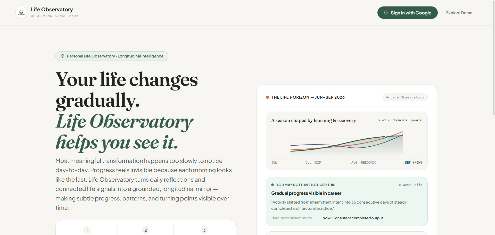
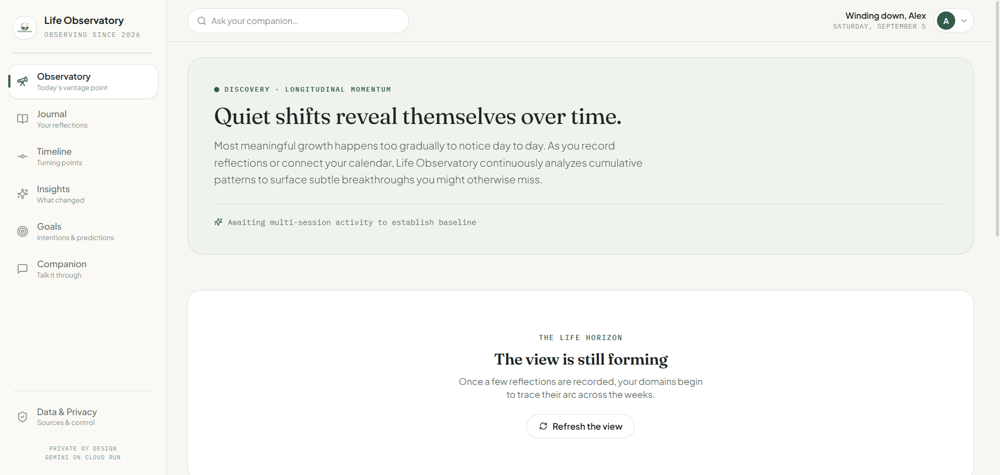
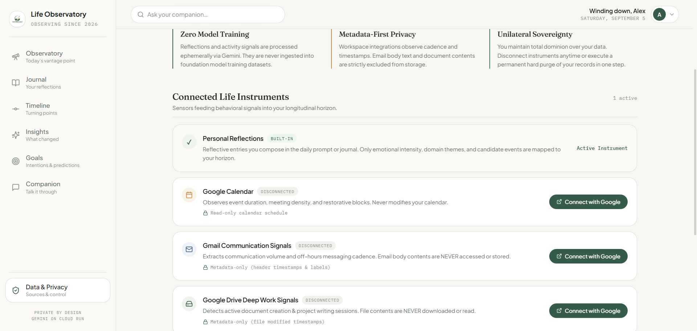
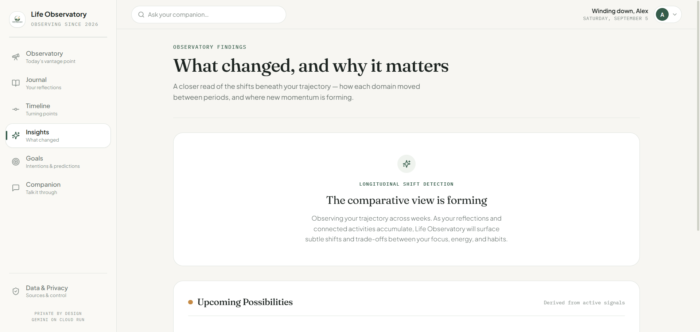
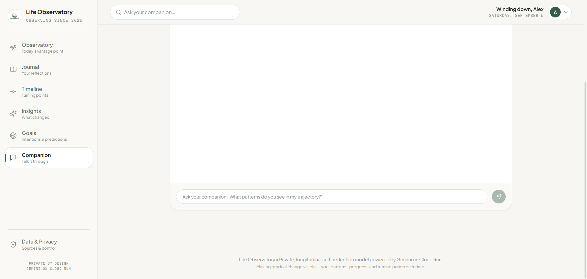

# Life Observatory 🌌

> **A personal longitudinal observatory that makes gradual change, invisible progress, and subtle life drift visible over time.**

[](https://cloud.google.com/run)
[](https://firebase.google.com)
[](https://firebase.google.com/docs/firestore)
[](https://ai.google.dev)
[](https://cloud.google.com/secret-manager)
[](https://codelabs.developers.google.com/codelabs/cloud-run/cloud-run-ai-challenge)

---

## Live Application

- **Production URL**: [`https://life-observatory-app-92008039582.us-central1.run.app`](https://life-observatory-app-92008039582.us-central1.run.app)
- **Architecture & Foundations**: See [`docs/PRODUCT_VISION.md`](docs/PRODUCT_VISION.md) for architectural foundations and design principles.

---

## 1. The Problem

Human beings live sequentially — one day, one conversation, one deadline at a time. Yet we evaluate our lives categorically across quarters, years, and decades.

Because human memory is selective, reconstructive, and vulnerable to recency bias, gradual personal change is remarkably difficult to notice:
- **Compounding progress feels invisible**: A 1% improvement each day looks identical to yesterday. Because you cannot see the needle moving, you often abandon valuable practices right before compounding takes hold.
- **Memory amplifies recent emotional spikes**: An exhausting Thursday afternoon can color your perception of an entire high-growth month.
- **Priorities drift quietly**: Nobody intentionally decides to neglect their health, abandon creative writing, or pull back from friendships. Instead, priorities shift millimeter by millimeter. By the time you notice, six months have quietly slipped away.
- **Major milestones are remembered, but foundational habits are forgotten**: We celebrate promotions, moves, and awards, but forget the subtle daily habits that generated them.

### Why Existing Tools Fail

| Category | Typical Experience | Fatal Flaw |
| :--- | :--- | :--- |
| **Traditional Journals** | Blank page, unstructured writing prompts. | High friction; zero longitudinal synthesis after six months. |
| **Habit Trackers** | Binary checkboxes, streak gamification. | Reductive and stressful; triggers guilt upon broken streaks; blind to life context. |
| **Mood Trackers** | Daily 1–10 scalar ratings or emoji pickers. | Strips away narrative richness; produces meaningless averages without context. |
| **Transactional Chatbots** | Ephemeral, prompt-by-prompt assistants. | Amnesic; resets context each session; zero longitudinal memory of who you were 60 days ago. |
| **Generic Dashboards** | Busy graphs with arbitrary "wellness scores". | Overwhelming and anxiety-inducing; metrics without meaning or inspectable provenance. |

---

## 2. The Human & Psychological Insight

Life Observatory is grounded in a central insight from cognitive psychology: **people experience life continuously, but remember it selectively.**

1. **Compounding Micro-Deltas**: The most consequential personal changes happen so slowly that day-to-day senses cannot perceive them.
2. **Reflective Intelligence Over Scalar Judgment**: Humans do not need an algorithm giving them a grade or a "life score". They need a calm, objective mirror that reflects back their own trajectory over multi-month horizons.
3. **Objective Grounding for Subjective Feelings**: Connecting subjective emotional entries with factual life rhythms (calendar density, message cadence, deep-work activity) provides grounded clarity. When you felt overwhelmed, were you failing, or did you simply have 38 hours of meetings that week?

> ### ⚠️ Critical Non-Clinical Boundary
> Life Observatory is **not** a medical device, **not** a clinical diagnostic tool, **not** a psychiatric intervention, and **not** a replacement for licensed mental health therapy.  
> It is an intimate cognitive instrument designed for **self-reflection**, **longitudinal awareness**, and **reflective intelligence**. All AI insights remain strictly grounded in recorded evidence and never speculate or invent unobserved personal facts.

---

## 3. The Life Observatory Idea

Astronomy solved the challenge of observing distant, imperceptibly slow celestial movements by building **observatories** — steady, calibrated instruments that capture long exposures over extended periods.

**Life Observatory** brings that exact philosophy to human self-reflection:
- **Calm, low-friction daily capture** creates observational data points.
- **Longitudinal time horizons (30, 60, 90 days)** reveal the underlying personal trajectories.
- **Eligibility-gated synthesis** ensures insights are surfaced only when sustained, non-contradictory evidence exists.
- **Data sovereignty & privacy** guarantee that your life reflections remain strictly yours.

---

## 4. How It Works: The 6-Stage Planned Experience

Life Observatory is designed around an end-to-end, ambient reflective cycle:

```text
  ┌──────────┐      ┌──────────┐      ┌──────────┐
  │ 1. TALK  │ ───► │2. REFLECT│ ───► │3. OBSERVE│
  └──────────┘      └──────────┘      └──────────┘
       │                                   │
       ▼                                   ▼
  ┌──────────┐      ┌──────────┐      ┌──────────┐
  │4.DISCOVER│ ◄─── │5.REALITY │ ◄─── │ 6. LEARN │
  │          │      │  CHECK   │      │          │
  └──────────┘      └──────────┘      └──────────┘
```

### 1. TALK — Ambient, Low-Friction Interaction
Daily self-reflection should not demand opening an intimidating dashboard or staring at a blank page.
- **WhatsApp Daily Check-In**: The user can text or send a quick 20-second voice note via WhatsApp while commuting, walking, or winding down. The AI companion acknowledges naturally and, when an inflection or unaddressed tension is detected, responds with **one concise, highly adaptive follow-up** — never badgering or interrogating.
- **Web Conversational Space**: A distraction-free interactive environment for evening check-ins, deep-dive inquiries, and exploring trajectories.

### 2. REFLECT — Natural Language Over Rigid Ratings
Life cannot be quantified on a 1-to-5 slider.
- Write or speak freely in your own voice.
- `gemini-2.5-flash-lite` parses the entry using constrained JSON schemas to extract candidate events, life domains (*Career, Learning, Health, Relationships, Energy, Personal*), and emotional tone.
- The raw reflection is immutably stored in user-isolated Cloud Firestore records.

### 3. OBSERVE — The Life Horizon
Grounded in graphical perception research (Cleveland & McGill, 1984), comparative trajectories are perceived with highest cognitive accuracy when aligned along a common scale.
- **Life Horizon** plots multi-domain trajectories across an aligned, continuous temporal axis (30–90 days).
- Rather than a reductive single "wellness score", each domain develops its own rolling momentum curve computed deterministically from observed event cadence, emotional valence, and temporal decay.

### 4. DISCOVER — Invisible Progress & Turning Points
The primary discovery value of the observatory is surfacing what daily recency bias obscured:
- **Invisible Progress**: Surfaces quiet compounding improvements that you failed to notice (*"You noted high fatigue 4 times this week, yet your technical execution remained steady — 38% higher resilience compared to your 60-day baseline"*).
- **What Changed?**: Compares consecutive time periods (e.g., this month vs. last month) with animated transitions to highlight directional shifts across domains.
- **Key Turning Points**: Flags candidate inflection milestones where small habits compounded into a permanent trajectory shift.

### 5. REALITY CHECK — Surfacing Drift
Detects the divergence between stated intentions and actual daily investment:
- Identifies goals receiving consistent attention versus those quietly suffering from **goal drift**.
- Compares stated priorities against actual reflection focus, calendar commitments, and communication volume.

### 6. LEARN & LOOK FORWARD — Upcoming Possibilities
Synthesizes historical momentum, active goals, and unaddressed tensions to generate **forward-looking possibilities**:
- Framed strictly as *possibilities and gentle scenarios* rather than deterministic predictions.
- Empowers the user to test hypotheses, anticipate energy dips before major milestones, and make intentional adjustments.

---

## 5. Key Product Concepts

| Concept | Description | Grounded Provenance |
| :--- | :--- | :--- |
| **Life Horizon** | Aligned multi-domain momentum curves (*Career, Learning, Health, Relationships, Energy, Personal*) on a common time axis. | Deterministic rolling model computed from dated reflection events. |
| **Invisible Progress** | Proactive discovery banner: *"You may not have noticed this..."* highlighting compounding gains. | Requires 3+ observations, sustained positive delta, zero contradictions. |
| **What Changed?** | Comparative period transitions showing directional movement between earlier and recent baselines. | Quantified domain deltas with inspectable supporting dates. |
| **Key Turning Points** | Inflection milestones where small efforts compounded into visible trajectory shifts. | Interactive candidate review workflow: Confirm / Edit / Dismiss. |
| **Goals & Focus** | Neutral tracking that surfaces active goals versus goals experiencing silent drift. | Compares stated goals against observation frequency over time. |
| **Reality Check / Drift** | Visual audit identifying divergences between intended priorities and actual time allocation. | Cross-referenced reflections and connected calendar signals. |
| **Upcoming Possibilities** | Gentle forward-looking considerations derived from current momentum and active goals. | Grounded in active goals and historical trajectories. |
| **AI Companion** | Dual-mode thinking partner: warm conversational reflection for open queries; structured 5-part analytical breakdown for crossroads. | Bounded by user context in `<untrusted_user_data>` isolation wrappers. |
| **Evidence / Why Drawer** | Clickable inspectable drawer for every surfaced insight, showing source records and dates. | Direct reference to underlying Firestore event IDs and timestamps. |
| **Longitudinal Memory** | User-isolated semantic and temporal index enabling multi-month queries and memory synthesis. | Firestore subcollection `/users/{uid}/reflections` with temporal query indices. |
| **Connected Life Context** | Google Calendar, Gmail metadata, and Drive timestamps providing objective grounding. | Read-only OAuth tokens stored in Secret Manager / Firestore. |

---

## 6. Connected Life Context & Data Sovereignty

Life Observatory connects external life context to anchor subjective feelings in objective reality:

| Instrument | What Is Observed & Stored | What Is NEVER Accessed or Stored |
| :--- | :--- | :--- |
| **Google Calendar** | Meeting start/end timestamps, meeting density, event categories. Read-only. | Never creates, modifies, or deletes calendar events. |
| **Gmail Signals** | Header timestamps and communication volume cadence (e.g., late-night emails). | **Email bodies, message contents, subjects, and attachments are NEVER accessed or read.** |
| **Google Drive Signals** | Document creation and revision timestamps (focus session detection). | **Document contents, file bodies, and file downloads are NEVER opened or read.** |

- **User Controlled**: Each instrument requires explicit OAuth 2.0 consent and can be toggled individually.
- **Source-Specific Erasure**: Disconnecting an instrument removes all its derived observations without altering manual reflections.
- **Complete Right to Erasure**: A single click permanently deletes all user subcollections from Cloud Firestore and revokes OAuth credentials.

---

## 7. How AI Is Used: Gemini Intelligence

Life Observatory utilizes **Gemini 2.5 Flash** and **Gemini 2.5 Flash-Lite** via the official `@google/genai` SDK:

```text
┌─────────────────────────────────────────────────────────────────────────────┐
│                             Raw User Reflection                             │
└──────────────────────────────────────┬──────────────────────────────────────┘
                                       │
                                       ▼
┌─────────────────────────────────────────────────────────────────────────────┐
│ gemini-2.5-flash-lite : Candidate Event Extraction                          │
│ - Strict JSON Schema output                                                 │
│ - Domain mapping (Career, Learning, Health, Relationships, Energy, Personal)│
│ - Valence & emotional intensity quantification                              │
└──────────────────────────────────────┬──────────────────────────────────────┘
                                       │
                                       ▼
┌─────────────────────────────────────────────────────────────────────────────┐
│ Deterministic Life Engine (Mathematical Momentum Model)                     │
│ - Rolling multi-domain momentum                                             │
│ - Inflection point detection                                                │
│ - Eligibility gating (prevents LLM hallucination without evidence)          │
└──────────────────────────────────────┬──────────────────────────────────────┘
                                       │
                                       ▼
┌─────────────────────────────────────────────────────────────────────────────┐
│ gemini-2.5-flash : Longitudinal Insight & Companion Synthesis               │
│ - "Invisible Progress" synthesis (grounded in eligibility-gated deltas)     │
│ - Multi-turn conversational companion with longitudinal memory              │
│ - Structured 5-point strategic crossroad advisor                            │
└─────────────────────────────────────────────────────────────────────────────┘
```

### Prompt Injection Defense & Grounding
- User inputs and calendar summaries are wrapped in strict `<untrusted_user_data>` boundaries.
- System prompts enforce that user text is **data to be analyzed**, never instructions to execute.
- Gemini is instructed to remain strictly grounded in observed evidence and decline to speculate beyond available data.

---

## 8. Product Capabilities & Experience Matrix

Life Observatory delivers a comprehensive, multi-channel reflective intelligence system:

| Capability Area | Core Experience | Ongoing Platform Expansions |
| :--- | :--- | :--- |
| **Primary Interface** | Web application with serene dark observatory aesthetic, responsive across mobile and desktop. | Ambient WhatsApp & messaging bot integration. |
| **Daily Interaction** | Natural-language conversational check-in, reflective text stream, and interactive prompts. | Multimodal voice notes with tone and cadence analysis. |
| **Connected Context** | Google Calendar (read-only), Gmail volume cadence, Google Drive activity timestamps. | Additional developer & wellness instrumentation. |
| **Longitudinal Engine** | Deterministic 6-domain rolling momentum model with inflection detection. | Multi-tier hierarchical temporal index. |
| **Inflections & Shifts** | Candidate turning point detection with interactive Confirm / Edit / Dismiss workflow. | Automated retrospective narrative arc synthesis. |
| **Forward Horizon** | Possibilities & scenarios grounded in active goals, trajectory momentum, and unaddressed friction. | Multi-horizon trajectory simulations. |
| **Data Architecture** | Cloud Run, Firebase Auth, user-isolated Cloud Firestore, Secret Manager. | Multi-region deployment with edge caching. |

---

## 9. Google Cloud Architecture

```text
                                  ┌───────────────────────────┐
                                  │      User / Browser       │
                                  └─────────────┬─────────────┘
                                                │
                                  HTTPS + Firebase ID Token
                                                │
                                                ▼
┌─────────────────────────────────────────────────────────────────────────────────────────┐
│ Google Cloud Run Container                                                              │
│                                                                                         │
│  ┌─────────────────────────────────┐       ┌──────────────────────────────────────────┐ │
│  │ Express API & Static SPA Server │       │ Ingestion Pipeline                       │ │
│  │ - Helmet & Security Middleware  │ ───►  │ - Candidate Event Extraction             │ │
│  │ - Firebase Admin Auth Guard     │       │ - Domain Categorization                  │ │
│  └────────────────┬────────────────┘       └────────────────────┬─────────────────────┘ │
│                   │                                             │                       │
│                   ▼                                             ▼                       │
│  ┌─────────────────────────────────┐       ┌──────────────────────────────────────────┐ │
│  │ Deterministic Life Engine       │       │ Insight Engine                           │ │
│  │ - Multi-domain rolling momentum │ ───►  │ - Eligibility Gating                     │ │
│  │ - Inflection / turning points   │       │ - "Invisible Progress" Synthesis         │ │
│  └────────────────┬────────────────┘       └────────────────────┬─────────────────────┘ │
│                   │                                             │                       │
└───────────────────┼─────────────────────────────────────────────┼───────────────────────┘
                    │                                             │
      ┌─────────────┼──────────────────────────────┬──────────────┼─────────────┐
      │             │                              │              │             │
      ▼             ▼                              ▼              ▼             ▼
┌───────────┐ ┌──────────────┐             ┌───────────────┐ ┌─────────┐ ┌──────────────┐
│ Firebase  │ │ Cloud        │             │ Gemini API    │ │ Secret  │ │ Google       │
│ Auth      │ │ Firestore    │             │ (2.5 Flash &  │ │ Manager │ │ Workspace    │
│           │ │ (Isolated)   │             │ 2.5 Flash-Lite│ │         │ │ (Cal/Mail/Drv│
└───────────┘ └──────────────┘             └───────────────┘ └─────────┘ └──────────────┘
```

---

## 10. Live Application Screenshots

All screenshots captured directly from the live Cloud Run production deployment:

| 1. Landing View & Vision | 2. Observatory & Life Horizon |
| :---: | :---: |
|  |  |
| *Product positioning & Observe → Connect → Understand narrative* | *Multi-domain longitudinal momentum curves & Invisible Progress* |

| 3. Connected Instruments | 4. Period Insights ("What Changed?") | 5. Longitudinal AI Companion |
| :---: | :---: | :---: |
|  |  |  |
| *Google Workspace metadata controls & privacy boundaries* | *Period-to-period trajectory shifts & evidence provenance* | *Dual-mode conversational partner with long-term context* |

---

## 11. Tech Stack

- **Frontend**: React 19, TypeScript, Vite, Tailwind CSS, Lucide Icons
- **Backend**: Node.js 22, Express, TypeScript
- **AI / LLM**: Google Gemini API (`gemini-2.5-flash`, `gemini-2.5-flash-lite`) via `@google/genai`
- **Authentication**: Firebase Authentication (Google Sign-In)
- **Database**: Google Cloud Firestore (Native mode, user-isolated subcollections)
- **Deployment**: Google Cloud Run (Fully managed, containerized)
- **Secrets Management**: Google Cloud Secret Manager
- **External Integrations**: Google Calendar API, Gmail API (metadata), Google Drive API (timestamps)
- **Testing**: Vitest, Supertest (29 tests passing across 9 test suites)

---

## 12. Running Locally

### Prerequisites
- Node.js 20+ or 22+
- npm 10+
- Google Cloud CLI (`gcloud`) with an active Google Cloud project

### Step 1: Clone Repository
```bash
git clone https://github.com/mithunrajmr/Life-Observatory.git
cd Life-Observatory
```

### Step 2: Install Dependencies
```bash
npm install
cd client && npm install && cd ..
cd server && npm install && cd ..
```

### Step 3: Configure Environment
Create `server/.env`:
```env
PORT=8080
NODE_ENV=development
GCP_PROJECT_ID=your-gcp-project-id
GEMINI_API_KEY=your-gemini-api-key
CONVERSATION_MODEL=gemini-2.5-flash
EXTRACTION_MODEL=gemini-2.5-flash-lite
INSIGHT_MODEL=gemini-2.5-flash
GOOGLE_CLIENT_ID=your-oauth-client-id.apps.googleusercontent.com
GOOGLE_CLIENT_SECRET=your-oauth-client-secret
GOOGLE_REDIRECT_URI=http://localhost:8080/api/connections/google/callback
```

Create `client/.env.local`:
```env
VITE_FIREBASE_API_KEY=your-firebase-web-api-key
VITE_FIREBASE_AUTH_DOMAIN=your-project.firebaseapp.com
VITE_FIREBASE_PROJECT_ID=your-gcp-project-id
```

### Step 4: Run Locally
```bash
npm run dev
# Frontend: http://localhost:5173
# Backend:  http://localhost:8080
```

---

## 13. Cloud Run Deployment

Life Observatory is deployed as a containerized service with the official hackathon label:
`dev-tutorial=cloud-run-ai-challenge`

### Step 1: Configure Secret Manager
```bash
gcloud config set project YOUR_PROJECT_ID

# Store Gemini API Key
gcloud secrets create GEMINI_API_KEY --replication-policy="automatic"
echo -n "YOUR_API_KEY" | gcloud secrets versions add GEMINI_API_KEY --data-file=-

# Grant Cloud Run Service Account access
PROJECT_NUMBER=$(gcloud projects describe YOUR_PROJECT_ID --format='value(projectNumber)')
gcloud secrets add-iam-policy-binding GEMINI_API_KEY \
  --member="serviceAccount:${PROJECT_NUMBER}-compute@developer.gserviceaccount.com" \
  --role="roles/secretmanager.secretAccessor"
```

### Step 2: Deploy Container
```bash
gcloud run deploy life-observatory-app \
  --source . \
  --region us-central1 \
  --platform managed \
  --allow-unauthenticated \
  --labels dev-tutorial=cloud-run-ai-challenge \
  --set-env-vars NODE_ENV=production,GCP_PROJECT_ID=YOUR_PROJECT_ID,USE_CLOUD_FIRESTORE=true
```

---

## 14. Product Walkthrough & User Flow

Follow this 2–4 minute walkthrough to experience the end-to-end product:

1. **Open the Live Application**: Visit [`https://life-observatory-app-92008039582.us-central1.run.app`](https://life-observatory-app-92008039582.us-central1.run.app).
2. **Review the Landing Experience**: Inspect the product positioning (*"Your life changes gradually. Life Observatory helps you see it."*) and the **Observe → Connect → Understand** narrative.
3. **Sign In**: Click **"Sign In with Google"** (or use **"Demo Preview"** to explore immediate pre-populated longitudinal data).
4. **First-Login Guidance**: Notice the welcoming onboarding modal introducing the three life instruments (Calendar, Gmail, Drive) with clear privacy explanations.
5. **Explore the Life Horizon**: Navigate to the **Observatory** tab to inspect the aligned multi-domain trajectories across time.
6. **Notice Invisible Progress**: Review the top discovery banner highlighting quiet, compounding progress.
7. **Compose a Daily Reflection**: In the check-in card, enter a reflection (*e.g., "Spent 4 hours coding today, felt deeply energized and finished the architecture."*). Notice instant event extraction and trajectory updates.
8. **Inspect Turning Points & "What Changed?"**: Explore the **Timeline** and **Insights** tabs to review period-to-period shifts.
9. **Engage the AI Companion**: Open the **Companion** tab. Ask a reflective question (*"What patterns do you notice in my energy?"*) or a strategic decision question (*"Should I take on this new project?"*) to see the structured analytical breakdown.
10. **Verify Provenance & Sovereignty**: Open **Data & Privacy** to review active connections, sync cadence, and the hard data purge guarantee.

---

## 15. Deployment & System Specifications

| Field | Specification |
| :--- | :--- |
| **Product Name** | Life Observatory |
| **Production URL** | `https://life-observatory-app-92008039582.us-central1.run.app` |
| **GitHub Repository** | `https://github.com/mithunrajmr/Life-Observatory` |
| **Cloud Run Service** | `life-observatory-app` (`dev-tutorial=cloud-run-ai-challenge`) |
| **Architecture Reference** | `#AccelerateAIwithCloudRun` |

### System Overview
> Life Observatory is a private longitudinal self-reflection platform that makes gradual change visible over time. People experience life continuously day-to-day, making subtle personal progress, shifting priorities, and emotional turning points difficult to notice. Built on Google Cloud Run, Life Observatory pairs daily reflections with connected Google Calendar, Gmail, and Google Drive activity signals. Using Gemini 2.5 Flash and Gemini 2.5 Flash-Lite, the system extracts candidate events with provenance into user-isolated Cloud Firestore subcollections protected by Firebase Authentication and explicit security rules. A deterministic Life Engine computes multi-domain trajectories across an aligned common time scale without misleading scalar life scores. An eligibility-gated Insight Engine surfaces invisible progress, period transitions, and goal drift. In production, Cloud Run securely accesses Gemini and OAuth credentials via Google Cloud Secret Manager.

---

## 16. License

Apache-2.0. See [LICENSE](LICENSE) and [SECURITY.md](SECURITY.md) for vulnerability disclosure and security policies.
